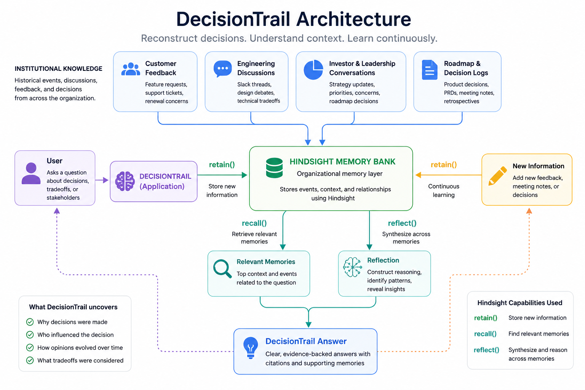
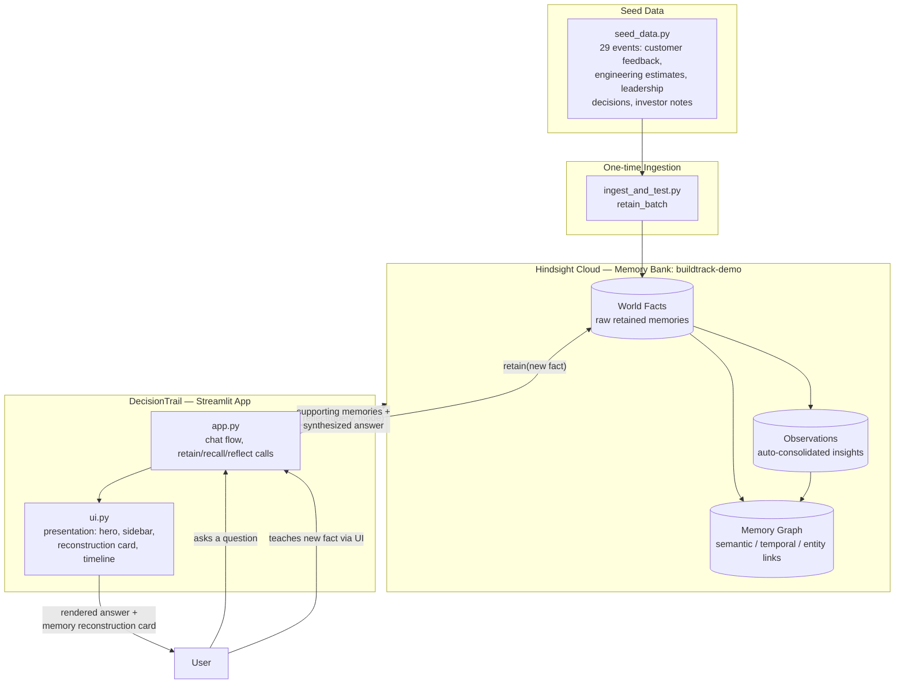
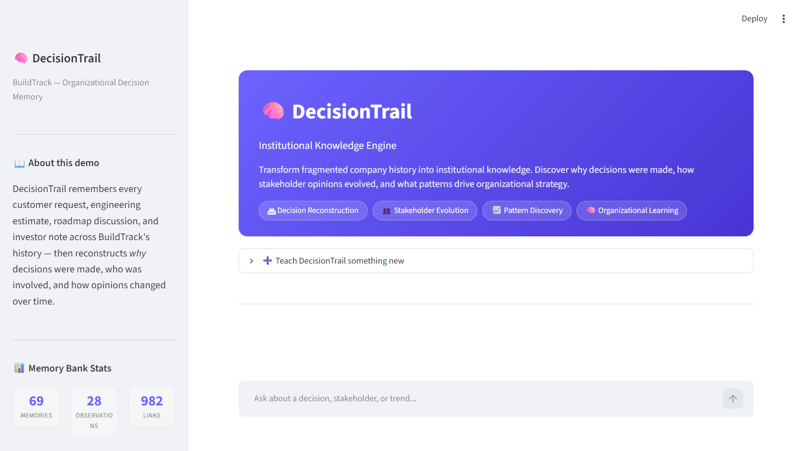
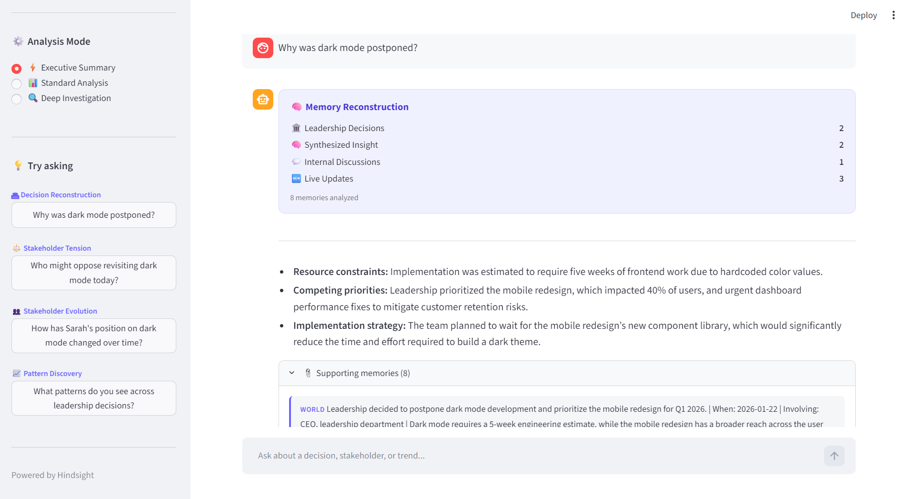
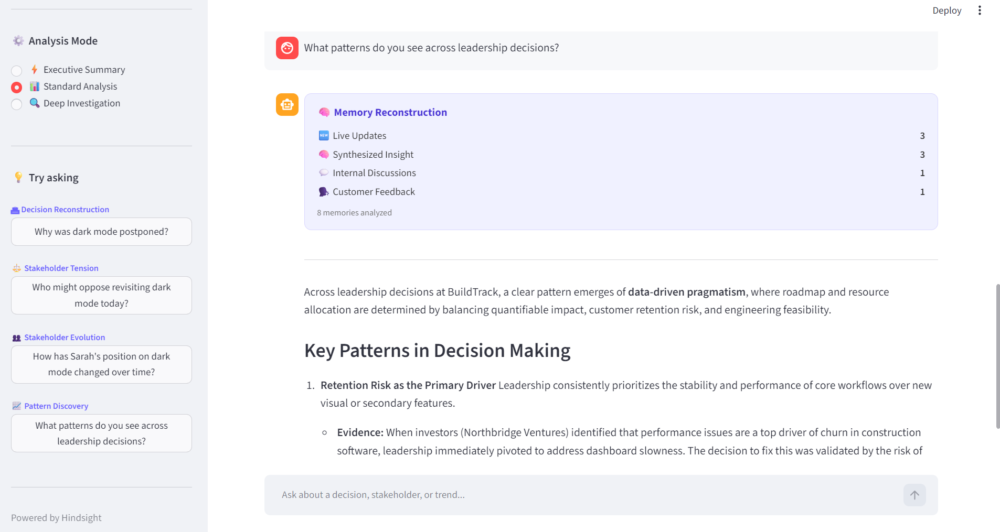
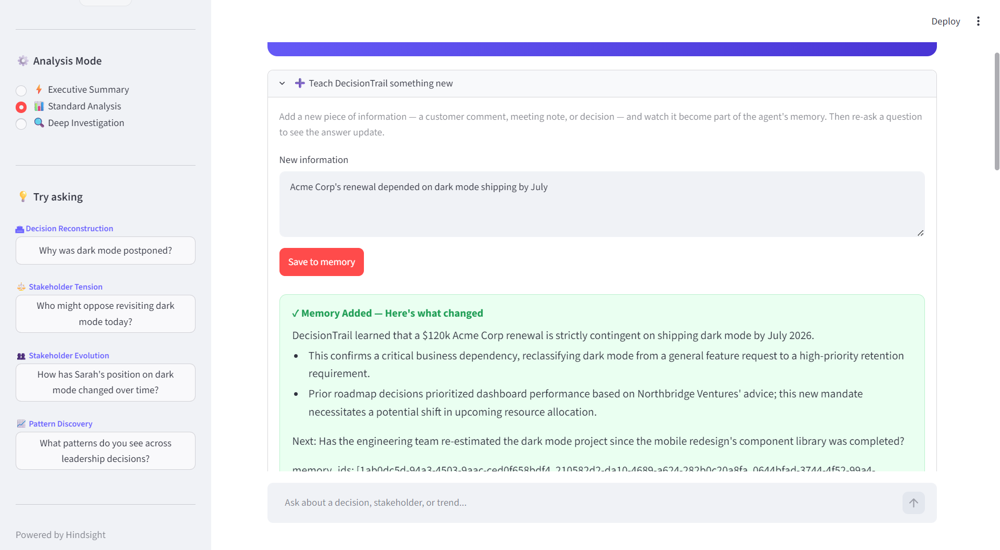

# DecisionTrail

**An institutional knowledge engine that reconstructs *why* your company made the decisions it made — and how stakeholder opinions evolved over time.**

> New product managers spend weeks reconstructing old decisions from scattered Slack threads, meeting notes, and tribal knowledge. DecisionTrail remembers customer feedback, engineering discussions, investor concerns, and roadmap debates — and reconstructs the reasoning behind any decision on demand.

---

## ✨ What it does

DecisionTrail is a chat interface over [Hindsight](https://hindsight.vectorize.io)'s memory layer, populated with ~3 months of a fictional construction-software company's history (customer requests, engineering estimates, leadership meetings, investor feedback).

Instead of just retrieving facts, it **reconstructs decisions** — synthesizing scattered, never-explicitly-connected fragments into coherent answers:

- 🏛 **Decision Reconstruction** — *"Why was dark mode postponed?"*
- ⚖️ **Stakeholder Tension** — *"Who might oppose revisiting dark mode today?"*
- 👥 **Stakeholder Evolution** — *"How has Sarah's position on dark mode changed over time?"*
- 📈 **Pattern Discovery** — *"What patterns do you see across leadership decisions?"*

It also supports **live learning**: add a new piece of information through the UI, and DecisionTrail immediately shows what it learned and how future answers might change — demonstrating memory that evolves, not just memory that's preloaded.

---

## 🏗 Architecture



<details>
<summary><strong>Detailed Developer Architecture</strong></summary>



</details>

**Plain-text summary of the flow:**

```
User question
   │
   ▼
Streamlit app (app.py)
   │
   ├──> Hindsight.recall(query)   ──> returns supporting "world" facts +
   │                                   "observation" (consolidated) memories
   │
   └──> Hindsight.reflect(query)  ──> returns a synthesized natural-language
                                       answer, reasoning across memories
   │
   ▼
ui.py renders:
   - 🧠 Memory Reconstruction card (which sources were consulted)
   - Synthesized answer (Executive / Standard / Deep mode)
   - 📎 Supporting memories (expandable)

Separately:
User teaches DecisionTrail something new
   │
   ▼
Hindsight.retain(new_fact)  ──> stored in memory bank
   │
   ▼
Hindsight.reflect("what changed?") ──> "✓ Memory Added" impact card
```

---

## 🧠 How Hindsight powers DecisionTrail

This project is built around three Hindsight operations, all against a single memory bank (`buildtrack-demo`):

| Operation | What it does in DecisionTrail |
|---|---|
| **`retain()`** | Stores every customer comment, engineering estimate, meeting note, and investor remark as a *separate*, timestamped memory with metadata (`source`, `stakeholder`, `department`, `thread`). No single memory states "the decision" outright — each is just a fragment. |
| **`recall()`** | Given a question, returns the relevant raw "world" facts *and* Hindsight's auto-consolidated "observations" — memories Hindsight has already synthesized from multiple related facts. These are surfaced in the UI's "📎 Supporting memories" panel and the "🧠 Memory Reconstruction" card, so the answer is never a black box. |
| **`reflect()`** | The core of the project. Rather than just retrieving facts, `reflect()` reasons across scattered memories to reconstruct *why* a decision happened, *who* was involved, and *how* opinions changed — producing insights that were never explicitly stored as a single memory. |

**Live learning loop:** when a user adds a new fact through the "➕ Teach DecisionTrail something new" panel, it's immediately `retain()`-ed into the same bank. A follow-up `reflect()` call explains what changed and what it might imply — demonstrating that the memory bank is a living system, not a static preloaded dataset.

> During testing, after teaching DecisionTrail that Acme Corp's renewal depended on dark mode shipping by July, follow-up investigations began incorporating renewal risk and customer retention concerns into their reasoning. This demonstrated that newly retained memories immediately influenced future reflections.

---

## 🛠 Tech Stack

- **Memory layer:** [Hindsight Cloud](https://ui.hindsight.vectorize.io) (`hindsight-client` Python SDK)
- **UI:** [Streamlit](https://streamlit.io)
- **LLM:** synthesis is performed by Hindsight's `reflect()` (Hindsight Cloud Reflect (Gemini-backed configuration))
- **Language:** Python 3.10

---

## 📂 Project Structure

```
decisiontrail/
├── app.py              # App logic & flow: Hindsight client, retain/recall/reflect, chat loop
├── ui.py               # Presentation only: CSS, sidebar, hero, cards (no Hindsight calls)
├── seed_data.py        # 29 seed events across 4 narrative threads
├── ingest_and_test.py  # One-time script: ingests seed_data into Hindsight + sanity-checks queries
├── requirements.txt    # Python dependencies
├── .env.example        # Template for required environment variables
├── .gitignore
└── README.md
```

---

## 🚀 Setup & Running Locally

### 1. Clone and create a virtual environment

```bash
git clone https://github.com/Srinvitha/DecisionTrail
cd decisiontrail
python -m venv venv
# Windows:
venv\Scripts\activate
# macOS/Linux:
source venv/bin/activate
```

### 2. Install dependencies

```bash
pip install -r requirements.txt
```

### 3. Configure Hindsight credentials

Get your API key from [ui.hindsight.vectorize.io](https://ui.hindsight.vectorize.io) (Connect → Create API Key).

Create a `.env` file in the project root (see `.env.example`):

```
HINDSIGHT_BASE_URL=https://api.hindsight.vectorize.io
HINDSIGHT_API_KEY=your-api-key-here
```

### 4. Seed the memory bank (one-time)

```bash
python ingest_and_test.py
```

This creates the `buildtrack-demo` memory bank and ingests 29 seed memories. It also runs a handful of sanity-check queries so you can confirm `recall`/`reflect` are working before launching the UI.

### 5. Run the app

```bash
streamlit run app.py
```

Open the printed local URL (default `http://localhost:8501`).

---

## 🎥 Demo

- **Live Demo:** Run locally via Streamlit
- **Demo video:** [Using Hindsight to Give AI Long-Term Organizational Memory](https://youtu.be/PQFg61eqnSA)

### Suggested demo flow

1. *"Why was dark mode postponed?"* — decision reconstruction from scattered fragments
2. *"Who might oppose revisiting dark mode today?"* — stakeholder-position synthesis
3. *"How has Sarah's position on dark mode changed over time?"* — memory evolution over months
4. *"What patterns do you see across leadership decisions?"* — cross-decision pattern discovery
5. Open **"➕ Teach DecisionTrail something new"**, add a new fact, observe the "✓ Memory Added" impact card
6. Re-ask question 2 — observe how the answer incorporates the new information

---
## 📈 Continuous Learning

DecisionTrail is not a static knowledge base.

Users can add new customer feedback, meeting notes, or decisions directly through the UI.

New information is immediately retained into the Hindsight memory bank and influences future investigations.

This allows the system to evolve as organizational knowledge changes over time.

## 📸 Screenshots






---

## 🔮 Future Improvements

- Auto-generated "Related Investigations" follow-up questions (via an additional `reflect()` call)
- Structured "Investigation Summary" card (key finding, stakeholders, decision date)
- Real integrations (Slack, Jira, support tickets) feeding `retain()` directly instead of seed data
- Multi-bank support for multiple organizations/teams

---

## 🙏 Acknowledgements

Built with [Hindsight](https://hindsight.vectorize.io) by [Vectorize](https://github.com/vectorize-io/hindsight) — a memory layer that gives AI agents the ability to remember, recall, and improve over time.

By Srinvitha Nutakki